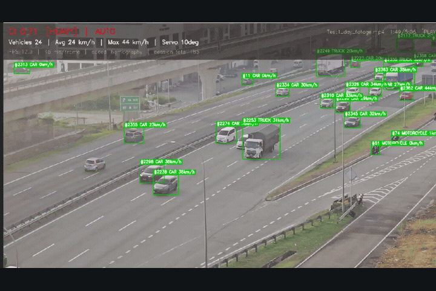
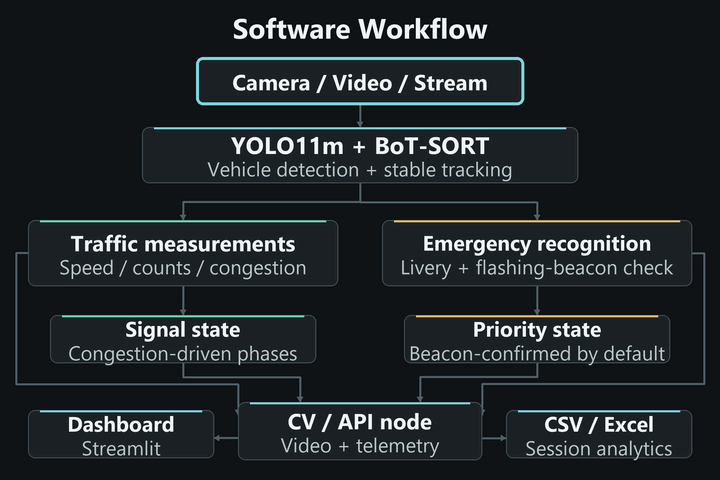
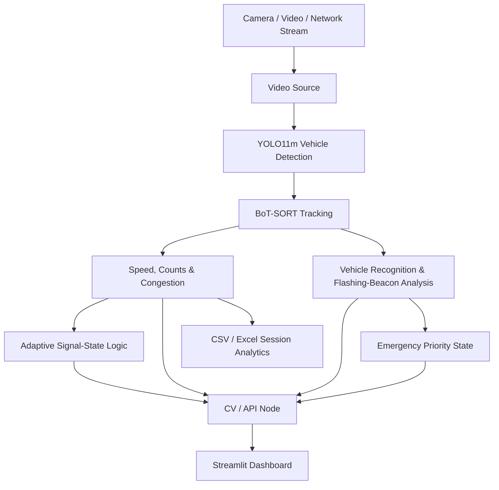

# Smart Traffic Management Software

Computer-vision traffic analytics and adaptive signal-control software built with Python, YOLO11m, OpenCV and Streamlit.

This repository is intentionally **software-only**. Physical prototype drawings, Arduino/ESP32 firmware, servo sketches, coursework files and generated runtime data are not kept here.

## Demo & Software Workflow

<table>
  <tr>
    <th width="50%">Vehicle Detection Demo</th>
    <th width="50%">System Workflow & Architecture</th>
  </tr>
  <tr>
    <td></td>
    <td></td>
  </tr>
</table>

The detection demo uses recorded traffic footage. The workflow animation is a schematic of the default software flow, not synchronized live telemetry.

[Watch the full detection and dashboard demo](assets/presentation/demo.mp4) · [View the static workflow](assets/presentation/workflow.png)

## Main features

- YOLO11m vehicle detection and BoT-SORT tracking
- Vehicle counting and traffic-density estimation
- Calibrated vehicle-speed estimation in km/h
- Congestion analysis and adaptive signal-state logic
- Emergency-vehicle recognition and flashing-beacon analysis
- Camera, video-file and network-stream inputs
- Streamlit monitoring dashboard
- CSV/XLSX session analytics
- Simulation/fallback services for software testing
- Automated tests for the vision pipeline, dashboard, analytics, video sources and signal state machine

## Software architecture



The computer-vision node is implemented mainly in `broadcast_server.py`, `traffic_vision.py` and `video_source.py`. The dashboard and supporting services are under `SmartTrafficSystem/`.

Traffic measurements drive the signal state machine. Emergency recognition and beacon verification produce a separate priority state; recognizing an emergency-style vehicle is not the same as detecting an active flashing beacon.

## Quick start

Install dependencies:

```bash
pip install -r requirements.txt
pip install -r SmartTrafficSystem/requirements.txt
```

Start the complete software stack without physical controllers:

```bash
python start.py --no-arduino
```

Examples:

```bash
python start.py --source road.mp4 --no-arduino
python start.py --source rtsp://... --no-arduino
python start.py --no-display --no-arduino
```

The dashboard normally runs on port `8501`; the CV/API node uses port `8502`.

## Project structure

```text
smart-traffic-system/
├── README.md
├── docs/
│   └── SOFTWARE_GUIDE.md       # architecture, pipeline, testing and metrics notes
├── start.py                    # starts the complete software stack
├── broadcast_server.py         # CV node and local API
├── traffic_vision.py           # detection, tracking, speed and congestion
├── video_source.py             # camera/file/stream input handling
├── traffic_light.py            # adaptive signal state machine
├── emergency_vision.py         # emergency-vehicle recognition
├── siren_vision.py             # flashing-beacon analysis
├── calibrate_speed.py          # speed-calibration utility
├── SmartTrafficSystem/         # Streamlit dashboard and backend
├── trackers/                   # tracker configuration
├── assets/                     # software test assets
├── test_*.py                   # automated software tests
├── yolo11m.pt                  # main vehicle detector
├── emergency_cls.pt            # emergency classification model
└── requirements.txt
```

## Testing

Useful checks:

```bash
python -m compileall -q .
python test_traffic_light.py
python test_traffic_system.py
python test_video_source.py
python test_analytics.py
```

Some integration tests exercise optional controller/serial interfaces in simulation or through mocked responses. Those files remain because they are software interfaces and part of the application code; no physical-controller firmware is stored in this repository.

## Documentation

See [`docs/SOFTWARE_GUIDE.md`](docs/SOFTWARE_GUIDE.md) for the consolidated explanation of the processing pipeline, emergency recognition, software modules, testing and measured performance.
